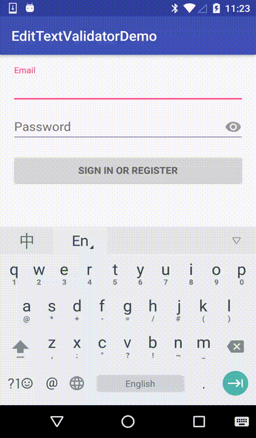

# android-editext-validator

用于对输入框文本的校验和提示:  
效果如下图  


使用挺方便的
```java

  private boolean checkPwdInput() {
      return ValidatorHelper.from(mPasswordView)
              .set(new EmptyValidator("请输入密码"))
              .and(new DigitLengthRangeValidator("密码要求6~20位",6,20))
              .fix("")
              .check(true);
  }

  private boolean checkEmailInput() {
      return ValidatorHelper.from(mEmailView)
              .set(new EmptyValidator("请输入邮箱"))
              .and(new EmailValidator("邮箱格式有误"))
              .check(true);
  }

```


此工程中的Validator使用 [其他工程](https://github.com/vekexasia/android-edittext-validator) 的实现  
之所以重新起一个库,基于以下考虑:  
    1. 对方的库使用自定义组件在xml中布局的,对于现有项目的改造和使用多有不便
    2. 链式调用更方便
    3. 系统自带的Validator,只提供了校验和修复,未有提示功能,现融合两者功能,提供fix能力


对于自定义Validator只需要继承Validator,实现其isValid方法,  然后通过ValidatorHelper来使用了

```java

  class MinLengthValidator extends Validator {
        private int mMinLength;
        public MinLengthValidator(String errorMessage,int minLength) {
            super(errorMessage);
            mMinLength = minLength;
        }

        @Override
        public boolean isValid(EditText et) {
            String str = et.getText().toString();
            int length = str == null?0:str.length();
            return length >= mMinLength;
        }
    }


    private boolean checkUserName() {
        return ValidatorHelper.from(userNameEditText)
                .set(new MinLengthValidator("用户名至少需要6位",6))
                .check(true);
    }

```
对于有多种条件的校验
建议,将其逐个拆解开,使用and 和 or来组合  

    1. and 表示当前添加的Validator与之前的设置的validator 进行条件&&操作
    2. or 表示当前添加的Validator与之前的设置的validator 进行条件 || 操作
    3. 提供了NotValidator来包装已有的Validator做取反操作

.fix(String str)方法用于 在用户输入有误时候,你想修改为啥
比如在用户输入密码格式有误情况下将其置空

同时欢迎大家积极的补充各种其他方式的Validator实现
